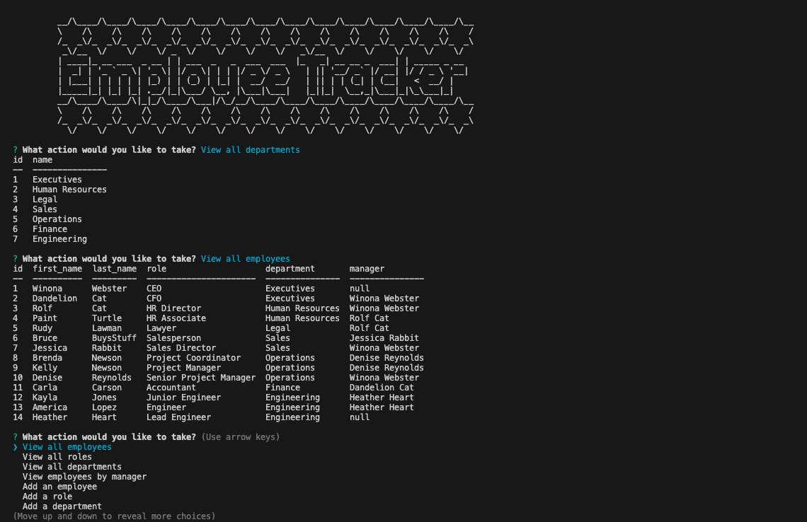
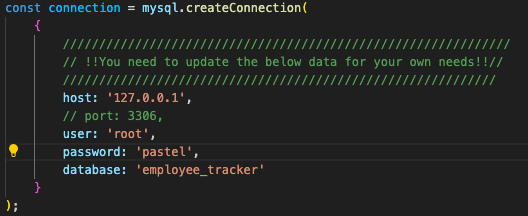
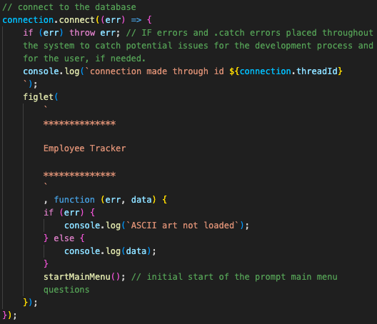
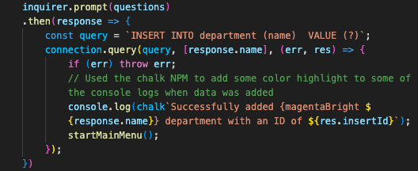
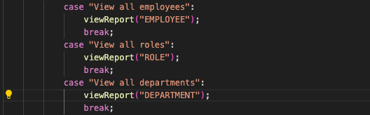
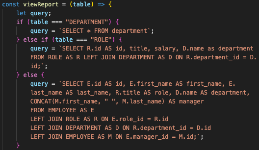
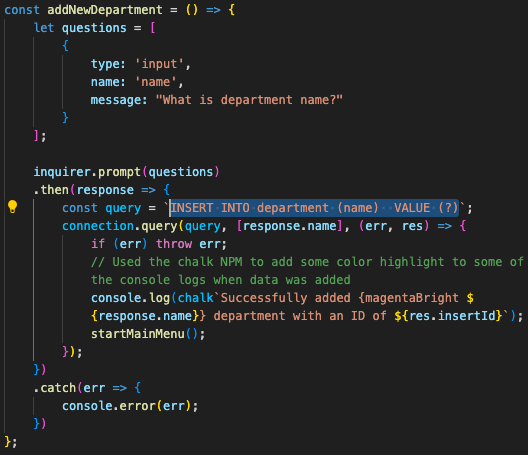
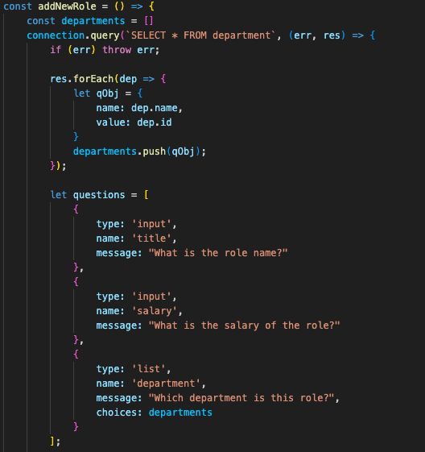
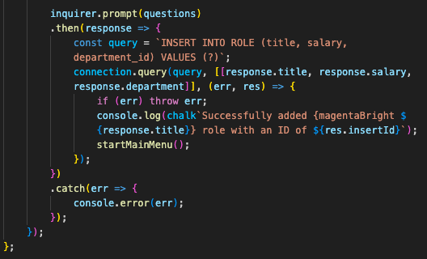

# JANET'S EMPLOYEE TRACKER

### [View Project Video Here](https:// "JANET'S EMPLOYEE TRACKER")<br />

| Technology Used    | Resource URL |
| --------  | ------- |
| NodeJS      | https://nodejs.org/en |
| Inquirer      | https://www.npmjs.com/package/inquirer |
| MySQL      | https://www.mysql.com/ |
| mysql2      | https://www.npmjs.com/package/mysql2 |
| Screencastify | https://www.screencastify.com/ |
| JavaScript | https://developer.mozilla.org/en-US/docs/Web/JavaScript |
| Git       | https://git-scm.com/ |
| GitHub     | https://github.com/ |
| VSCode    | https://code.visualstudio.com/ |

## Table of Contents

* [Description](#description)
* [Installation](#installation)
* [Usage](#usage)
* [Credits](#credits)
* [License](#license)

## Description:
This employee tracker application acts as a content management system that is run through NodeJS CLI.<br />
<br />

#### How to use this app:

* Recommended Requirements: 
  * Node.JS
  * CLI
  * VSCode 
* Installation:
  * Clone the repo to your device 
  * Initiate NPM 
  * Install all dependencies
  * IMPORTANT: Use MySQL to SOURCE schema.sql and seeds.sql
* Open Integrated Terminal (CLI) 
* type "npm start" 
* Follow the question prompts to make necessary updates
  * View Departments, Roles, and Employees
  * View manager and budget reports
  * Add Department, Role, and Employee
  * Delete Employee, Role, and Department
* To end the program select "Quit" at the bottom of the main menu

### User Story

```md
AS A business owner
I WANT to be able to view and manage the departments, roles, and employees in my company
SO THAT I can organize and plan my business
```

### Acceptance Criteria

```md
GIVEN a command-line application that accepts user input
WHEN I start the application
THEN I am presented with the following options: view all departments, view all roles, view all employees, add a department, add a role, add an employee, and update an employee role
WHEN I choose to view all departments
THEN I am presented with a formatted table showing department names and department ids
WHEN I choose to view all roles
THEN I am presented with the job title, role id, the department that role belongs to, and the salary for that role
WHEN I choose to view all employees
THEN I am presented with a formatted table showing employee data, including employee ids, first names, last names, job titles, departments, salaries, and managers that the employees report to
WHEN I choose to add a department
THEN I am prompted to enter the name of the department and that department is added to the database
WHEN I choose to add a role
THEN I am prompted to enter the name, salary, and department for the role and that role is added to the database
WHEN I choose to add an employee
THEN I am prompted to enter the employee’s first name, last name, role, and manager, and that employee is added to the database
WHEN I choose to update an employee role
THEN I am prompted to select an employee to update and their new role and this information is updated in the database 
```

### Lessons Learned

#### 1. mysql2 -> connection
For this project it required a mysql server connection. This was accomplished through using the mysql2 NPM. The connection was essential in sending queries to the SQL database. Because of this need it was used prolifically throughout the application. Here are a few examples.
<br />






#### 2. SQL Reports
Building reports with SQL is super powerful, but also very difficult. This required a lot of research to determine how to best layout this information. For all of the view (department, role, employee), I combined into one action and used an if statement to determine what would display.
<br />



#### 3. Insert queries with placeholders
The question mark (?) and other placeholders can be used to insert values into the db using parameterized queries. This helps to prevent bad data injection attacks and makes the code more reusable.
<br />


#### 4. Quering data to push it
To keep the content management system live and reactive it required being able to pull on the data already in the system, so that we could then push the current available options to the prompts when needed. This was done through a query connection and then for each object item they were pushed to a variable, which then was used to display the questino options. See the example below.
<br />



#### Synopsis
This project was difficult. It required me reviewing all of the code drills and lessons to determine how to accomplish that. Even with that I still had to do research to figure out how things worked and needed to work. I did end up having fun adding a couple aspects like figlet and chalk and cTables to improve the user experience.

## Installation

1. Create a new repository on GitHub, to store this project.
2. Clone the repository to your computer.
3. Copy files to your own repository.
4. Follow the steps for "How to" above
5. Make changes to the code.
6. Commit the changes to the local repo.
7. Push the changes to the remote repo.

## Usage

This is a content management app for employee tracking. If you would like to use this app follow the installation steps and curate it to your needs. If you would like to use this app, follow the steps under the description above and click the link at the top of this page.

## License

MIT License
Copyright (c) 2023 Twixmixy / Janet Webster

<hr />

## About The Author
### Janet Webster
Full Stack MERN Software Engineer in training.

- [GitHub](https://github.com/TwixmixyJanet/)
- [LinkedIn](https://www.linkedin.com/in/twixmixy/)
- [Twitter](https://twitter.com/Twixmixy)
- [WakaTime](https://wakatime.com/@Twixmixy)

